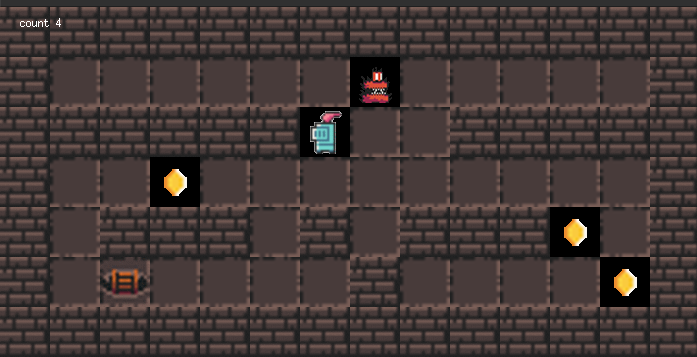

# so_long

A simple 2D game using MiniLibX (MLX). Move the player, collect items, avoid enemies, and reach the exit.



## Build

The project links against the prebuilt MiniLibX shipped in `minilibx_copy/libmlx_Linux.a`.

Requirements (Ubuntu/Debian):
- build-essential, gcc, make
- pkg-config
- X11 development libraries: libx11-dev, libxext-dev, libxrender-dev, libxfixes-dev, libxi-dev, libxinerama-dev, libxrandr-dev
- zlib1g-dev, libbsd-dev
- Optional: libxcursor-dev

Commands:
```
sudo apt-get update
sudo apt-get install build-essential pkg-config \
  libx11-dev libxext-dev libxrender-dev libxfixes-dev libxi-dev libxinerama-dev libxrandr-dev \
  zlib1g-dev libbsd-dev libxcursor-dev
make
```

### Download MiniLibX on Linux
To ensure MiniLibX is properly set up, run:
```
sudo apt-get update && sudo apt-get install xorg libxext-dev zlib1g-dev libbsd-dev
```

Run:
```
./so_long maps/map.ber
```

## Ubuntu 24.10 (oracular) note
Ubuntu 24.10 is EOL. If `apt-get update` or package installs return 404, point your APT sources to old-releases:

1. Backup sources
```
sudo cp /etc/apt/sources.list /etc/apt/sources.list.bak
```
2. Replace Ubuntu mirrors with `http://old-releases.ubuntu.com/ubuntu` in:
- `/etc/apt/sources.list`
- `/etc/apt/sources.list.d/ubuntu.sources` (Deb822 entries)

Example lines (for both files where applicable):
```
deb http://old-releases.ubuntu.com/ubuntu oracular main restricted universe multiverse
deb http://old-releases.ubuntu.com/ubuntu oracular-updates main restricted universe multiverse
deb http://old-releases.ubuntu.com/ubuntu oracular-backports main restricted universe multiverse
deb http://old-releases.ubuntu.com/ubuntu oracular-security main restricted universe multiverse
```
Then:
```
sudo apt-get update
```
Install the dependencies listed above and build with `make`.

## Controls
- Esc: quit
- Arrow keys or WASD: move

## Images
An example image of the game is available in the `imgs` folder as `game.png`.

## Troubleshooting
- Linker errors like `cannot find -lXext`, `-lXi`, `-lXinerama`: install the X11 dev packages listed above.
- `pkg-config: command not found`: `sudo apt-get install pkg-config`.
- If MLX build under `mlx/` fails, this project uses the prebuilt MLX in `minilibx_copy/`; just run `make` in the root.

## Note
The `imgs` folder contains an example image of the game (`game.png`) to give you an idea of how the game looks.
